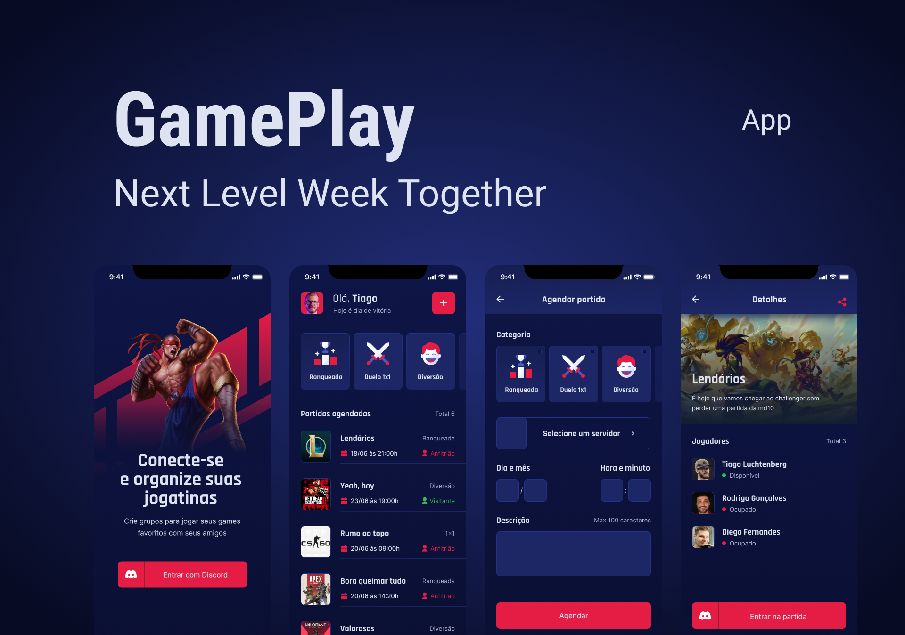

# gameplay
Project to apply react-native concepts and techniques (&lt;nlw/> together)

<h1 align="center">
    
</h1>

 

## 🧪 Technologies

This project was developed using the following technologies:

- [React Native](https://reactnative.dev/)
- [Expo](https://expo.io/)

## 🔖 Layout

You can view the project layout through the link below:

- [Layout](<https://www.figma.com/proto/FAwtQqqVDPhvHgfgdqIhhl/GamePlay-NLW-Together-Copy?node-id=58924%3A891&scaling=min-zoom&page-id=58913%3A83>)

Remembering that you need to have a [Figma](http://figma.com/) account to access it.

---

 
README.md inspired by [birobirobiro](https://www.birobirobiro.dev)
 
